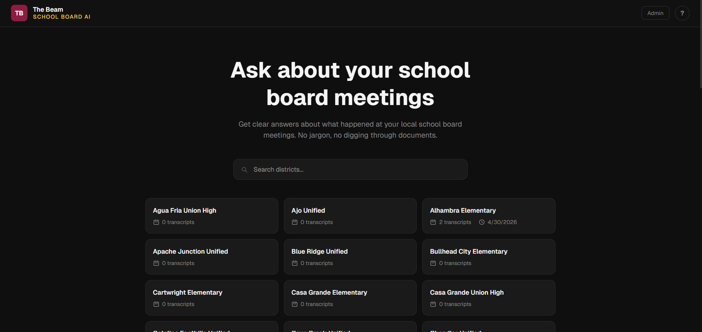
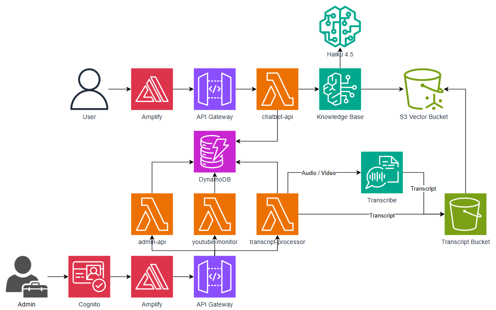

# The Beam — School Board AI

An AI-powered platform that helps journalists and citizens understand what happened at Arizona school board meetings. The system monitors YouTube channels for new board meeting videos, allows admins to upload transcripts, and provides a conversational AI chatbot that answers questions using RAG (Retrieval-Augmented Generation) powered by AWS Bedrock.

## Demo Video

Watch the complete demonstration of The Beam School Board AI:

<div align="center">
  <a href="#">
    
  </a>
  <p><em>Click the image above to watch the demo</em></p>
</div>

## Disclaimers

Customers are responsible for making their own independent assessment of the information in this document.

This document:

(a) is for informational purposes only,

(b) references AWS product offerings and practices, which are subject to change without notice,

(c) does not create any commitments or assurances from AWS and its affiliates, suppliers or licensors. AWS products or services are provided "as is" without warranties, representations, or conditions of any kind, whether express or implied. The responsibilities and liabilities of AWS to its customers are controlled by AWS agreements, and this document is not part of, nor does it modify, any agreement between AWS and its customers, and

(d) is not to be considered a recommendation or viewpoint of AWS.

Additionally, you are solely responsible for testing, security and optimizing all code and assets on GitHub repo, and all such code and assets should be considered:

(a) as-is and without warranties or representations of any kind,

(b) not suitable for production environments, or on production or other critical data, and

(c) to include shortcuts in order to support rapid prototyping such as, but not limited to, relaxed authentication and authorization and a lack of strict adherence to security best practices.

All work produced is open source. More information can be found in the GitHub repo.

## Index

| Description           | Link                                                  |
| --------------------- | ----------------------------------------------------- |
| Overview              | [Overview](#overview)                                 |
| Architecture          | [Architecture](#architecture-diagram)                 |
| Quick Start           | [Quick Start](#quick-start)                           |
| Documentation         | [Documentation](#documentation)                       |
| Credits               | [Credits](#credits)                                   |
| License               | [License](#license)                                   |

## Overview

This application combines AI-powered conversational intelligence with school board meeting transcripts to make local government more accessible. Built on a serverless AWS architecture, the system monitors 72 Arizona school district YouTube channels for new board meeting videos, provides an admin dashboard for transcript management, and delivers a public-facing chatbot that answers questions with citations from indexed meeting transcripts.

### Key Features

- **AI-Powered Q&A** powered by AWS Bedrock with Claude Haiku 4.5 and Amazon Titan Embed Text v2
- **YouTube Channel Monitoring** using YouTube Data API v3 to discover new board meeting videos every 6 hours
- **Manual Transcript Upload** supporting transcript past and audio/video files (processed via AWS Transcribe)
- **Per-District Chatbots** with district-scoped RAG queries and citation support
- **Admin Dashboard** with Cognito authentication for district management, transcript uploads, and analytics
- **Usage Analytics** tracking queries per district, answer rates, and top community concerns
- **72 Arizona Districts** pre-configured with YouTube channel URLs
- **Fully Serverless** with no infrastructure to manage — Lambda, DynamoDB, S3, Bedrock, Amplify

## Architecture Diagram



- **Frontend**: Next.js application hosted on AWS Amplify with Cognito authentication
- **Backend**: AWS CDK deployable infrastructure — API Gateway, Lambda, Bedrock Knowledge Base, DynamoDB, S3, Transcribe

For a detailed deep dive into the architecture, including component interactions, data flow, DynamoDB schemas, and cost analysis, see [docs/architectureDeepDive.md](docs/architectureDeepDive.md).

## Quick Start

1. **Configure AWS credentials**

```bash
# For AWS SSO (recommended)
aws sso login --profile your-profile-name
export AWS_PROFILE=your-profile-name
export AWS_REGION=us-west-2
```

2. **Clone the repository**

```bash
git clone https://github.com/ASUCICREPO/schoolbot.git
cd schoolbot
```

3. **Run the deployment script**

```bash
bash ./deploy.sh
```

## Documentation

- **[API Documentation](docs/APIDoc.md)** - Comprehensive API reference for all endpoints
- **[Architecture Deep Dive](docs/architectureDeepDive.md)** - Detailed system architecture and design
- **[Deployment Guide](docs/deploymentGuide.md)** - Deployment instructions, prerequisites and step-by-steps
- **[User Guide](docs/userGuide.md)** - Step-by-step usage instructions
- **[Modification Guide](docs/modificationGuide.md)** - Guide for customizing and extending the system
- **[Model Justification](docs/modelJustification.md)** - Rationale for AI model selection

## Credits

This application was developed by:

- <a href="https://www.linkedin.com/in/shawnneill24/" target="_blank">Shawn Neill</a>
- <a href="https://www.linkedin.com/in/shakthiarun22/" target="_blank">Lahari Shakthi Arun</a>
- <a href="https://www.linkedin.com/in/jennnyen/" target="_blank">Jenny Nguyen</a>

Built for The Beam at the ASU Walter Cronkite School of Journalism and Mass Communication.

## License

See [LICENSE](LICENSE) file for details.
